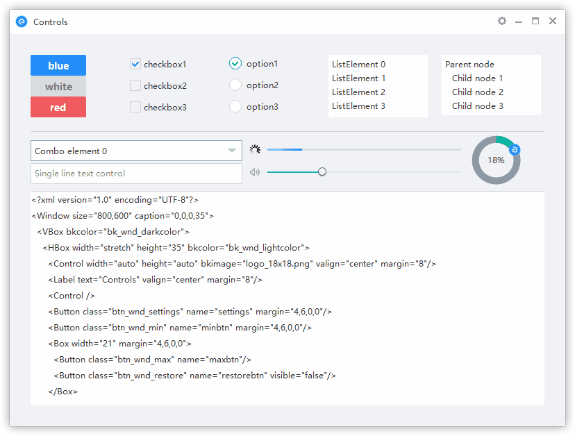

# Cobalt Native UI Framework

Cobalt is a native C++ Object-Oriented UI and UI Thread Management Framework originating from [NIM Duilib](https://github.com/netease-im/NIM_Duilib_Framework) that catalyzes rapid development and choreography of native Win32 UI to complement interactive applications emphasizing lowest-latency real-time rendering, audio processing and network transport.  

*Cobalt is the modular User Interface Layer for Win32 Desktop [and tentatively for non-Darwin] client platforms that operates in parallel to 3rdGen's Accelerated Graphics Layer, CoreRender. Together, Cobalt's C++ Window API and CoreRender's modular C APIs provide the "rails" for implementing UI and full-scene 3D render pipelines respectively within 3rdGen's proprietary simulation engine and cross-platform application framework, Cobalt Rhenium.* 

## Features

 - Multi language support
 - Global style support
 - DPI scaling support
 - GIF animation support
 - CEF control support（based on CEF 2623, support XP）
 - Touch device support（surface, wacom）
 - Abstract rendering interface (support for other rendering engines)

## Preview



## Start

Clone the repo into your disk.

```bash
git clone https://github.com/3rdGen-Media/Cobalt
```

Enter the `Cobalt/examples` directory，Open `examples.sln` with Visual Studio 2019 or higher ，press `F7` to compile all projects.

## Documentation

 - [Getting Started](docs/GETTING-STARTED.md)
 - [Docs](docs/SUMMARY.md)
    
## Structure

├─`base` Base libraries.  
├─`bin` Examples output directories，include skin and language files and CEF dependencies.  
├─`docs` Documentation of Duilib.  
├─`duilib` Duilib core, depend on base project.  
├─`libs` Static library output directories, include CEF static library.  
├─`examples` Examples of Duilib.  
├─`third_party` Third party for CEF.  
├─`ui_components` UI components based on Duilib, such as `msgbox`,`toast`,`cef_control`  

## Communication

 - Question: Read the [Documentation](docs/SUMMARY.md) and [Examples code](examples/README.md) to help you.
 - Report: File a bug in GitHub issues.
 - Suggestion: Request a new feature in Github issues.
